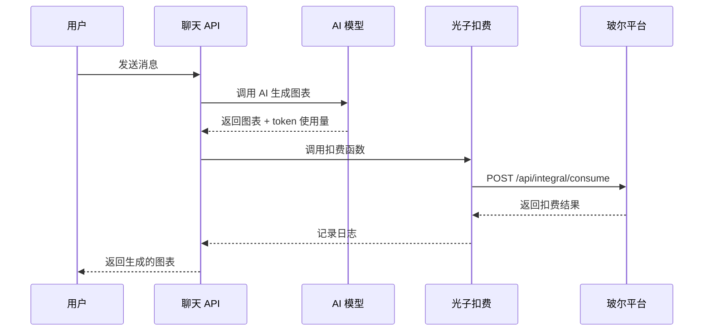

# 玻尔平台光子扣费集成指南

本文档介绍如何在 Figsci 项目中配置和使用玻尔平台的光子扣费功能。

## 目录

- [1. 什么是光子](#1-什么是光子)
- [2. 前置条件](#2-前置条件)
- [3. 配置步骤](#3-配置步骤)
- [4. 使用方式](#4-使用方式)
- [5. 扣费规则](#5-扣费规则)
- [6. 开发调试](#6-开发调试)
- [7. 常见问题](#7-常见问题)
- [8. 技术实现](#8-技术实现)

## 1. 什么是光子

**光子（Photon）** 是玻尔平台的虚拟货币。

- **用户**：可以通过参与活动、充值等方式获取光子
- **开发者**：可以通过开发玻尔 Apps，向用户收取光子

### 相关链接

- **光子充值入口**：https://www.bohrium.com/consume?tab=topUpPhoton&menu=balance
- **光子账单入口**：https://www.bohrium.com/consume?tab=photon&menu=bills
- **开发者文档**：https://dptechnology.feishu.cn/wiki/LQKKwMet7i70XNk3TcjcwH8jnJi

## 2. 前置条件

在集成光子扣费功能之前，需要完成以下准备工作：

### 2.1 申请 SKU ID

每个 App 需要有唯一对应的 `skuId`，请通过以下链接申请：

**申请地址**：https://dptechnology.feishu.cn/share/base/form/shrcnpCtBXBYZNWmwiNDMdGPH5c

### 2.2 获取开发者 Access Key（用于开发调试）

在开发调试阶段，可以使用开发者自己的 AK 进行测试：

1. 访问 https://www.bohrium.com/settings/user
2. 在页面中找到并复制你的 Access Key

**注意**：这只用于开发调试，生产环境应该通过 OAuth 获取用户 AK。

### 2.3 启用 OAuth 能力

在玻尔平台的 App 管理界面，创建新版本时：

1. 选择打开 **OAuth 能力**
2. 用户打开 App 时，会要求用户授权登录
3. 用户授权后，系统会自动将用户的 AK 信息存储在 Cookie 中

## 3. 配置步骤

### 3.1 复制环境变量配置文件

```bash
cp env.example .env.local
```

### 3.2 配置环境变量

在 `.env.local` 文件中添加以下配置：

```env
# ===== 玻尔平台光子扣费配置 =====

# 1. 启用光子扣费功能
NEXT_PUBLIC_ENABLE_PHOTON_CHARGE=true

# 2. 配置 SKU ID（从申请表获取）
BOHRIUM_SKU_ID=your-sku-id-here

# 3. 配置开发者 Access Key（仅用于开发调试）
BOHRIUM_DEV_ACCESS_KEY=your-access-key-here

# 4. 配置 Client Name（可选）
BOHRIUM_CLIENT_NAME=your-client-name-here

# 5. 选择扣费模式
# 'fixed' - 每次请求固定扣费（推荐）
# 'token' - 根据 token 使用量扣费
BOHRIUM_CHARGE_MODE=fixed

# 6. 配置扣费金额
# 固定扣费模式：每次请求扣除的光子数量
BOHRIUM_CHARGE_PER_REQUEST=1

# Token 扣费模式：每 1000 个 token 扣除的光子数量
BOHRIUM_CHARGE_PER_1K_TOKEN=1
```

### 3.3 重启应用

```bash
# 开发模式
pnpm dev

# 生产模式
pnpm build
pnpm start
```

## 4. 使用方式

### 4.1 自动扣费（推荐）

配置完成后，系统会在每次 AI 生成图表时**自动扣费**，无需额外代码：

1. 用户发送消息请求生成图表
2. AI 模型生成图表内容
3. 生成完成后，系统自动调用光子扣费 API
4. 扣费成功或失败的日志会在服务器控制台输出

**注意**：扣费失败不会影响图表生成，只会记录错误日志。

### 4.2 手动扣费（高级用法）

如果需要在特定场景手动调用扣费，可以使用提供的客户端工具：

```javascript
import { chargePhoton } from '@/lib/photon-client';

// 扣除指定数量的光子
try {
  const result = await chargePhoton(10, {
    scene: 'appCustomizeCharge', // 可选，默认值
    bizNo: 123456789 // 可选，不提供则自动生成
  });
  
  console.log('扣费成功：', result);
  // result: { success: true, message: "扣费成功", bizNo: 123456789, eventValue: 10 }
} catch (error) {
  console.error('扣费失败：', error);
}
```

## 5. 扣费规则

### 5.1 固定扣费模式（推荐）

每次 AI 生成请求扣除固定数量的光子，适用于大多数场景。

**配置**：
```env
BOHRIUM_CHARGE_MODE=fixed
BOHRIUM_CHARGE_PER_REQUEST=1  # 每次请求扣除 1 光子
```

**适用场景**：
- 简单、易理解的计费方式
- 用户体验更好（固定价格）
- 适合功能型应用

### 5.2 Token 扣费模式

根据实际消耗的 token 数量扣费，更公平但计费逻辑更复杂。

**配置**：
```env
BOHRIUM_CHARGE_MODE=token
BOHRIUM_CHARGE_PER_1K_TOKEN=1  # 每 1000 个 token 扣除 1 光子
```

**计费公式**：
```
扣费金额 = ceil((总 token 数 / 1000) × 每千 token 费用)
```

**适用场景**：
- 需要更精确的成本控制
- 用户请求复杂度差异较大
- 适合企业级应用

### 5.3 扣费示例

#### 固定扣费示例

```
用户 A：生成简单流程图（200 tokens） → 扣除 1 光子
用户 B：生成复杂架构图（5000 tokens） → 扣除 1 光子
```

#### Token 扣费示例（假设 1 光子/1000 tokens）

```
用户 A：生成简单流程图（200 tokens） → 扣除 1 光子（向上取整）
用户 B：生成复杂架构图（5000 tokens） → 扣除 5 光子
```

## 6. 开发调试

### 6.1 本地调试流程

1. **配置开发者 AK**
   ```env
   BOHRIUM_DEV_ACCESS_KEY=your-access-key-here
   ```

2. **启用扣费功能**
   ```env
   NEXT_PUBLIC_ENABLE_PHOTON_CHARGE=true
   ```

3. **测试扣费**
   - 启动应用：`pnpm dev`
   - 发送消息生成图表
   - 查看控制台日志：
     ```
     发起光子扣费请求： { bizNo: xxx, eventValue: 1, ... }
     光子扣费成功： { bizNo: xxx, eventValue: 1 }
     ```

### 6.2 测试不同扣费模式

#### 测试固定扣费

```env
BOHRIUM_CHARGE_MODE=fixed
BOHRIUM_CHARGE_PER_REQUEST=5
```

每次请求扣除 5 光子。

#### 测试 Token 扣费

```env
BOHRIUM_CHARGE_MODE=token
BOHRIUM_CHARGE_PER_1K_TOKEN=2
```

根据实际 token 使用量扣费（每 1000 token 扣除 2 光子）。

### 6.3 模拟用户扣费

要模拟真实用户扣费（而不是使用开发者 AK），需要：

1. 在玻尔平台创建测试用户
2. 为测试用户充值光子
3. 使用测试用户账号登录并授权
4. Cookie 中会包含用户的 AK
5. 扣费会从测试用户账户扣除

## 7. 常见问题

### Q1: 扣费失败会影响功能吗？

**答**：不会。扣费失败只会记录错误日志，不会中断图表生成流程。这是为了确保用户体验，即使扣费系统出现问题，用户仍然可以正常使用功能。

### Q2: 如何查看扣费记录？

**答**：
- **用户端**：https://www.bohrium.com/consume?tab=photon&menu=bills
- **开发者端**：https://www.bohrium.com/developer/financial-management

### Q3: 开发调试时会真实扣费吗？

**答**：是的。使用开发者 AK 时，扣费会从开发者账户真实扣除。建议：
1. 在开发阶段设置较小的扣费金额
2. 或者暂时关闭扣费功能：`NEXT_PUBLIC_ENABLE_PHOTON_CHARGE=false`

### Q4: 如何处理用户光子余额不足？

**答**：扣费 API 会返回错误码 403，你可以在前端捕获这个错误并提示用户充值。当前实现中，扣费失败不会影响功能使用，只会记录日志。

### Q5: OAuth 授权失败怎么办？

**答**：
1. 确保在玻尔平台 App 管理界面启用了 OAuth 能力
2. 检查用户是否正确授权
3. 查看浏览器 Cookie 中是否包含 `appAccessKey`

### Q6: 如何自定义扣费逻辑？

**答**：编辑 `app/api/chat/route.js` 中的 `chargePhotonIfEnabled` 函数，可以实现：
- 不同场景不同扣费金额
- 根据用户等级调整扣费
- 免费额度支持
- 等等

## 8. 技术实现

### 8.1 架构设计

```
用户请求
   ↓
聊天 API (/api/chat)
   ↓
AI 模型生成图表
   ↓
onFinish 回调 → chargePhotonIfEnabled()
   ↓
光子扣费 API (/api/photon/charge)
   ↓
玻尔平台扣费接口
```

### 8.2 核心文件

| 文件路径 | 说明 |
|---------|------|
| `app/api/photon/charge/route.js` | 光子扣费 API 路由 |
| `lib/photon-client.js` | 光子扣费客户端工具库 |
| `app/api/chat/route.js` | 聊天 API（集成了自动扣费） |

### 8.3 扣费流程

#### 流程图



#### 详细步骤

1. **用户发送请求**
   - 用户在聊天界面发送消息
   - 请求发送到 `/api/chat`

2. **AI 模型生成内容**
   - 聊天 API 调用 AI 模型
   - 模型生成图表内容
   - 记录 token 使用量

3. **自动触发扣费**
   - 在 `onFinish` 回调中调用 `chargePhotonIfEnabled()`
   - 检查是否启用扣费功能
   - 获取用户 AK（从 Cookie 或使用开发者 AK）

4. **调用扣费 API**
   - 计算扣费金额（根据配置的模式）
   - 生成唯一的 `bizNo`
   - 调用玻尔平台扣费接口

5. **处理扣费结果**
   - 成功：记录日志
   - 失败：记录错误，但不影响主流程

### 8.4 关键代码片段

#### 自动扣费函数

```javascript
// app/api/chat/route.js

async function chargePhotonIfEnabled(req, usage) {
  const enablePhotonCharge = process.env.NEXT_PUBLIC_ENABLE_PHOTON_CHARGE === 'true';
  
  if (!enablePhotonCharge) {
    return;
  }
  
  // 计算扣费金额
  const chargeMode = process.env.BOHRIUM_CHARGE_MODE || 'fixed';
  let eventValue = 0;
  
  if (chargeMode === 'token') {
    const chargePerKToken = parseFloat(process.env.BOHRIUM_CHARGE_PER_1K_TOKEN || '1');
    eventValue = Math.ceil((usage.totalTokens / 1000) * chargePerKToken);
  } else {
    eventValue = parseInt(process.env.BOHRIUM_CHARGE_PER_REQUEST || '1');
  }
  
  // 调用扣费 API...
}
```

#### 集成到聊天 API

```javascript
// app/api/chat/route.js

const result = await streamText(commonConfig);

return result.toUIMessageStreamResponse({
  onFinish: async ({ responseMessage, messages: messages2 }) => {
    // 记录 token 使用量
    const usage = await result.usage;
    
    // 自动扣费
    await chargePhotonIfEnabled(req, {
      inputTokens: usage.inputTokens,
      outputTokens: usage.outputTokens,
      totalTokens: usage.totalTokens
    });
  }
});
```

## 9. 合规性考量

根据玻尔平台的要求，开发者需要注意以下几点：

### 9.1 向用户清晰告知收费信息

在 App 中任何可能向用户收费的位置，应该：

1. **清晰展示收费金额**
   - 告知用户每次操作需要多少光子
   - 建议在 UI 中添加费用提示

2. **说明收费规则**
   - 什么情况下会扣费
   - 扣费金额如何计算

示例实现：
```jsx
// 在聊天界面添加费用提示
<div className="charge-notice">
  💰 每次生成图表需要 {chargeAmount} 光子
</div>
```

### 9.2 维护扣费记录

开发者应该维护一份数据记录，便于后续核对：

```javascript
// 示例：记录扣费日志到数据库
async function logChargeRecord(userId, bizNo, eventValue, result) {
  await database.chargeRecords.create({
    userId: userId,
    bizNo: bizNo,
    amount: eventValue,
    success: result.success,
    timestamp: new Date(),
    details: result
  });
}
```

### 9.3 查看光子收入

开发者可以在开发者后台查看光子收入：

**入口**：https://www.bohrium.com/developer/financial-management

**注意**：只有 2025 年 10 月 15 日之后的自定义 SKU 订单才会被统计。

## 10. 参考资源

- **玻尔平台开发者文档**：https://dptechnology.feishu.cn/wiki/LQKKwMet7i70XNk3TcjcwH8jnJi
- **SKU ID 申请表**：https://dptechnology.feishu.cn/share/base/form/shrcnpCtBXBYZNWmwiNDMdGPH5c
- **个人设置（获取 AK）**：https://www.bohrium.com/settings/user
- **光子充值**：https://www.bohrium.com/consume?tab=topUpPhoton&menu=balance
- **光子账单**：https://www.bohrium.com/consume?tab=photon&menu=bills
- **开发者财务管理**：https://www.bohrium.com/developer/financial-management

---

如有问题，请在 GitHub 上提 Issue 或参考玻尔平台官方文档。
