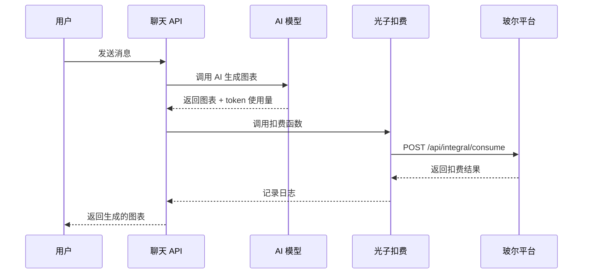

# 玻尔平台光子扣费功能 - 完整集成文档

本文档是玻尔平台光子扣费功能的完整集成和使用指南，整合了快速开始指南和完整集成指南的所有内容，记录了为 Figsci 项目集成玻尔平台光子扣费功能所做的所有修改和使用说明。

## 📅 集成日期

2024-12-06

## 📋 功能概述

集成了玻尔平台的光子扣费功能，支持在用户使用 AI 生成图表时自动扣除光子费用。

### 什么是光子

**光子（Photon）** 是玻尔平台的虚拟货币。

- **用户**：可以通过参与活动、充值等方式获取光子
- **开发者**：可以通过开发玻尔 Apps，向用户收取光子

**相关链接**：
- **光子充值入口**：https://www.bohrium.com/consume?tab=topUpPhoton&menu=balance
- **光子账单入口**：https://www.bohrium.com/consume?tab=photon&menu=bills
- **开发者文档**：https://dptechnology.feishu.cn/wiki/LQKKwMet7i70XNk3TcjcwH8jnJi

### 主要特性

- ✅ 自动扣费：AI 生成完成后自动扣费
- ✅ 多种计费模式：固定扣费 / 按 Token 使用量扣费 / 混合扣费
- ✅ OAuth 集成：支持从 Cookie 获取用户 AK
- ✅ 开发调试支持：使用开发者 AK 进行本地测试
- ✅ 错误处理：扣费失败不影响主功能
- ✅ 完整文档：提供详细的配置和使用文档

## ⚡ 快速开始（5 分钟配置）

### 前置检查清单

在开始之前，请确保已完成：

- [ ] 已申请并获得 SKU ID
- [ ] 已获取开发者 Access Key（用于开发调试）
- [ ] 已在玻尔平台启用 OAuth 能力（用于生产环境）

**相关链接**：
- **SKU ID 申请表**：https://dptechnology.feishu.cn/share/base/form/shrcnpCtBXBYZNWmwiNDMdGPH5c
- **获取开发者 AK**：https://www.bohrium.com/settings/user

### 步骤 1: 配置环境变量

编辑 `.env.local` 文件，添加以下配置：

```env
# 启用光子扣费
NEXT_PUBLIC_ENABLE_PHOTON_CHARGE=true

# SKU ID（从申请表获取）
BOHRIUM_SKU_ID=your-sku-id-here

# 开发者 Access Key（用于本地调试）
BOHRIUM_DEV_ACCESS_KEY=your-access-key-here

# 扣费模式：fixed（固定） 或 token（按量）
BOHRIUM_CHARGE_MODE=fixed

# 每次请求扣除的光子数量
BOHRIUM_CHARGE_PER_REQUEST=1
```

### 步骤 2: 重启应用

```bash
pnpm dev
```

### 步骤 3: 测试扣费

1. 打开应用：http://localhost:6002
2. 发送消息生成图表
3. 查看控制台日志，确认扣费成功：

```
发起光子扣费请求： { bizNo: 1733490123456, eventValue: 1, ... }
光子扣费成功： { bizNo: 1733490123456, eventValue: 1 }
```

### 快速排查问题

**扣费失败**：
1. 检查 SKU ID 是否正确配置
2. Access Key 是否有效
3. 用户光子余额是否充足
4. 查看控制台错误日志

**OAuth 未生效**：
1. 玻尔平台是否启用了 OAuth 能力
2. 用户是否完成授权
3. Cookie 中是否包含 `appAccessKey`

### 前置条件详细说明

在集成光子扣费功能之前，需要完成以下准备工作：

#### 1. 申请 SKU ID

每个 App 需要有唯一对应的 `skuId`，请通过以下链接申请：

**申请地址**：https://dptechnology.feishu.cn/share/base/form/shrcnpCtBXBYZNWmwiNDMdGPH5c

#### 2. 获取开发者 Access Key（用于开发调试）

在开发调试阶段，可以使用开发者自己的 AK 进行测试：

1. 访问 https://www.bohrium.com/settings/user
2. 在页面中找到并复制你的 Access Key

**注意**：这只用于开发调试，生产环境应该通过 OAuth 获取用户 AK。

#### 3. 启用 OAuth 能力

在玻尔平台的 App 管理界面，创建新版本时：

1. 选择打开 **OAuth 能力**
2. 用户打开 App 时，会要求用户授权登录
3. 用户授权后，系统会自动将用户的 AK 信息存储在 Cookie 中

## 📁 新增文件

### 1. API 路由

**文件**：`app/api/photon/charge/route.js`

**功能**：光子扣费 API 端点

**说明**：
- 提供独立的光子扣费接口
- 支持从 Cookie 或环境变量获取 AK
- 完整的错误处理和日志记录

### 2. 客户端工具库

**文件**：`lib/photon-client.js`

**功能**：光子扣费客户端工具函数

**提供的函数**：
- `chargePhoton(eventValue, options)` - 调用光子扣费
- `calculateChargeAmount(messageCount)` - 根据消息数量计算扣费
- `calculateChargeByTokens(tokenUsage)` - 根据 token 使用量计算扣费
- `isPhotonChargeEnabled()` - 检查是否启用扣费

### 3. UI 组件

**文件**：`components/photon-charge-notice.jsx`

**功能**：光子扣费相关的 UI 组件

**包含组件**：
- `PhotonChargeNotice` - 扣费提示组件
- `PhotonInsufficientNotice` - 余额不足提示
- `PhotonChargeHistory` - 扣费历史记录

### 4. 文档

本文档整合了以下文档的所有内容，提供了完整的集成说明和使用指南：

- **快速开始指南**：5 分钟快速配置步骤
- **完整集成指南**：详细的功能介绍、配置步骤、扣费规则、技术实现等
- **变更说明**：集成过程中的文件变更和代码修改记录


## 🔧 修改的文件

### 1. 聊天 API

**文件**：`app/api/chat/route.js`

**修改内容**：

1. 新增 `chargePhotonIfEnabled()` 函数
   - 在 AI 生成完成后自动调用
   - 支持两种计费模式
   - 完整的错误处理

2. 在 `streamText` 的 `onFinish` 回调中集成扣费
   ```javascript
   onFinish: async ({ responseMessage, messages: messages2 }) => {
     // ... 记录 token 使用量 ...
     
     // 光子扣费
     await chargePhotonIfEnabled(req, {
       inputTokens: totalUsage.inputTokens,
       outputTokens: totalUsage.outputTokens,
       totalTokens: (totalUsage.inputTokens || 0) + (totalUsage.outputTokens || 0)
     });
   }
   ```

3. 在非流式响应中也集成扣费
   ```javascript
   // 在 generateText 完成后调用
   await chargePhotonIfEnabled(req, {
     inputTokens: result.usage.inputTokens,
     outputTokens: result.usage.outputTokens,
     totalTokens: (result.usage.inputTokens || 0) + (result.usage.outputTokens || 0)
   });
   ```

### 2. 环境变量配置示例

**文件**：`env.example`

**新增配置**：

```env
# ===== 玻尔平台光子扣费配置 =====

# 是否启用光子扣费功能
NEXT_PUBLIC_ENABLE_PHOTON_CHARGE=false

# SKU ID（必需，如果启用扣费）
BOHRIUM_SKU_ID=

# 开发者 Access Key（用于开发调试）
BOHRIUM_DEV_ACCESS_KEY=

# 开发者 Client Name（可选）
BOHRIUM_CLIENT_NAME=

# 扣费模式：'fixed' 或 'token'
BOHRIUM_CHARGE_MODE=fixed

# 固定扣费金额
BOHRIUM_CHARGE_PER_REQUEST=1

# 基于 Token 的扣费金额
BOHRIUM_CHARGE_PER_1K_TOKEN=1

# 用户界面显示配置（可选）
NEXT_PUBLIC_PHOTON_CHARGE_PER_MESSAGE=1
NEXT_PUBLIC_PHOTON_CHARGE_PER_1K_TOKEN=1
```

### 3. README 文档

**文件**：`README_CN.md`

**修改内容**：

1. 在"配置说明"部分添加了光子扣费配置示例
2. 在"文档"部分添加了光子扣费文档链接

## 🎯 使用方法

### 最小配置（固定扣费模式）

在 `.env.local` 中添加：

```env
# 启用光子扣费
NEXT_PUBLIC_ENABLE_PHOTON_CHARGE=true

# 配置 SKU ID
BOHRIUM_SKU_ID=your-sku-id-here

# 配置开发者 AK（用于开发调试）
BOHRIUM_DEV_ACCESS_KEY=your-access-key-here

# 每次请求扣除 1 光子
BOHRIUM_CHARGE_MODE=fixed
BOHRIUM_CHARGE_PER_REQUEST=1
```

### 生产环境配置

1. **启用 OAuth**：在玻尔平台 App 管理界面启用 OAuth 能力

2. **配置环境变量**：
   ```env
   NEXT_PUBLIC_ENABLE_PHOTON_CHARGE=true
   BOHRIUM_SKU_ID=your-sku-id-here
   BOHRIUM_CHARGE_MODE=fixed
   BOHRIUM_CHARGE_PER_REQUEST=1
   ```

3. **用户授权**：用户首次使用时需要授权，系统会自动获取用户 AK

### 显示扣费提示（可选）

在聊天界面组件中添加：

```jsx
import { PhotonChargeNotice } from '@/components/photon-charge-notice';

function ChatPanel() {
  return (
    <div>
      {/* 显示扣费提示 */}
      <PhotonChargeNotice className="mb-4" />
      
      {/* 聊天界面 */}
      <ChatMessages />
      <ChatInput />
    </div>
  );
}
```

### 进阶配置选项

#### 按 Token 使用量计费

如果需要根据实际 token 消耗进行更精确的计费：

```env
BOHRIUM_CHARGE_MODE=token
BOHRIUM_CHARGE_PER_1K_TOKEN=1  # 每 1000 个 token 扣除 1 光子
```

#### 在前端显示扣费信息

集成扣费提示组件，让用户清楚了解扣费规则：

```jsx
import { PhotonChargeNotice } from '@/components/photon-charge-notice';

function ChatPanel() {
  return (
    <div>
      {/* 显示扣费提示 */}
      <PhotonChargeNotice />
      
      {/* 你的聊天界面 */}
      <ChatMessages />
      <ChatInput />
    </div>
  );
}
```

#### 自定义扣费逻辑

编辑 `app/api/chat/route.js` 中的 `chargePhotonIfEnabled` 函数，可以实现：

- 根据用户等级调整扣费
- VIP 用户免费或折扣
- 免费额度支持
- 特殊场景的扣费规则

```javascript
async function chargePhotonIfEnabled(req, usage) {
  // 根据用户等级调整扣费
  const userLevel = getUserLevel(req);
  
  if (userLevel === 'vip') {
    // VIP 用户免费或折扣
    return;
  }
  
  // 自定义扣费逻辑...
}
```

## 💰 扣费规则详解

### 固定扣费模式

每次 AI **成功**生成请求扣除固定数量的光子，任务中断或异常时不收费。

**配置**：
```env
BOHRIUM_CHARGE_MODE=fixed
BOHRIUM_CHARGE_PER_REQUEST=1  # 每次成功请求扣除 1 光子
```

**扣费逻辑**：
- ✅ 任务成功完成（finishReason 为 'stop' 或 'tool-calls'）：收取固定费用
- ❌ 任务中断/异常/网络错误：不收费

**适用场景**：
- 简单、易理解的计费方式
- 用户体验更好（固定价格）
- 适合功能型应用

### Token 扣费模式

根据实际消耗的 token 数量扣费，**无论任务是否成功完成都会收费**。

**配置**：
```env
BOHRIUM_CHARGE_MODE=token
BOHRIUM_CHARGE_PER_1K_TOKEN=1  # 每 1000 个 token 扣除 1 光子
```

**计费公式**：
```
扣费金额 = ceil((总 token 数 / 1000) × 每千 token 费用)
```

**扣费逻辑**：
- ✅ 任务成功完成：按实际 token 使用量收费
- ✅ 任务中断/异常：按已使用的 token 数量收费

**适用场景**：
- 需要更精确的成本控制
- 用户请求复杂度差异较大
- 适合企业级应用

### 混合扣费模式（推荐）

同时使用固定扣费和按量扣费，固定费用仅在任务成功完成时收取，token 费用无论任务是否完成都会收取。

**配置**：
```env
BOHRIUM_CHARGE_MODE=mixed
BOHRIUM_CHARGE_PER_REQUEST=1   # 每次成功请求额外扣除 1 光子
BOHRIUM_CHARGE_PER_1K_TOKEN=1  # 每 1000 个 token 扣除 1 光子
```

**计费公式**：
```
# 任务成功完成时：
总扣费 = 固定费用 + ceil((总 token 数 / 1000) × 每千 token 费用)

# 任务中断/异常时：
总扣费 = ceil((总 token 数 / 1000) × 每千 token 费用)
```

**扣费逻辑**：
- ✅ Token 费用：无论任务是否完成，都按实际使用量收取
- ✅ 固定费用：仅在任务成功完成时额外收取

**适用场景**：
- 需要兼顾公平性和用户体验
- 希望对成功完成的任务有额外收益
- 适合大多数商业应用

### 扣费示例

#### 固定扣费示例（1 光子/请求）

```
用户 A：生成简单流程图（200 tokens，成功） → 扣除 1 光子
用户 B：生成复杂架构图（5000 tokens，成功） → 扣除 1 光子
用户 C：生成图表中断（3000 tokens，中断） → 不扣费
```

#### Token 扣费示例（1 光子/1000 tokens）

```
用户 A：生成简单流程图（200 tokens，成功） → 扣除 1 光子（向上取整）
用户 B：生成复杂架构图（5000 tokens，成功） → 扣除 5 光子
用户 C：生成图表中断（3000 tokens，中断） → 扣除 3 光子
```

#### 混合扣费示例（固定 1 光子 + 1 光子/1000 tokens）

```
用户 A：生成简单流程图（200 tokens，成功） → 扣除 2 光子（1 固定 + 1 token）
用户 B：生成复杂架构图（5000 tokens，成功） → 扣除 6 光子（1 固定 + 5 token）
用户 C：生成图表中断（3000 tokens，中断） → 扣除 3 光子（仅 token 费用）
```

## 🔍 代码示例

### 自动扣费（已集成）

无需额外代码，系统在 AI 生成完成后自动扣费：

```javascript
// app/api/chat/route.js

const result = await streamText(commonConfig);

return result.toUIMessageStreamResponse({
  onFinish: async ({ responseMessage, messages: messages2 }) => {
    const usage = await result.usage;
    
    // 自动扣费
    await chargePhotonIfEnabled(req, {
      inputTokens: usage.inputTokens,
      outputTokens: usage.outputTokens,
      totalTokens: usage.totalTokens
    });
  }
});
```

### 手动扣费（高级用法）

如需在其他场景手动扣费：

```javascript
import { chargePhoton } from '@/lib/photon-client';

async function handleCustomAction() {
  try {
    const result = await chargePhoton(5, {
      scene: 'appCustomizeCharge'
    });
    
    console.log('扣费成功：', result);
  } catch (error) {
    console.error('扣费失败：', error.message);
  }
}
```

## 🧪 测试步骤

### 1. 配置环境变量

创建 `.env.local` 文件并配置必需的变量。

### 2. 启动应用

```bash
pnpm dev
```

### 3. 测试扣费

1. 打开应用：http://localhost:6002
2. 发送消息生成图表
3. 查看控制台输出：

```
发起光子扣费请求： {
  bizNo: 1733490123456,
  eventValue: 1,
  chargeMode: 'fixed',
  tokenUsage: { inputTokens: 100, outputTokens: 200, totalTokens: 300 }
}
光子扣费成功： { bizNo: 1733490123456, eventValue: 1 }
```

### 4. 验证扣费

访问玻尔平台查看扣费记录：
https://www.bohrium.com/consume?tab=photon&menu=bills

## 🔧 开发调试详细指南

### 本地调试流程

1. **配置开发者 AK**
   ```env
   BOHRIUM_DEV_ACCESS_KEY=your-access-key-here
   ```

2. **启用扣费功能**
   ```env
   NEXT_PUBLIC_ENABLE_PHOTON_CHARGE=true
   ```

3. **测试扣费**
   - 启动应用：`pnpm dev`
   - 发送消息生成图表
   - 查看控制台日志：
     ```
     发起光子扣费请求： { bizNo: xxx, eventValue: 1, ... }
     光子扣费成功： { bizNo: xxx, eventValue: 1 }
     ```

### 测试不同扣费模式

#### 测试固定扣费

```env
BOHRIUM_CHARGE_MODE=fixed
BOHRIUM_CHARGE_PER_REQUEST=5
```

每次**成功**请求扣除 5 光子，中断/异常时不扣费。

#### 测试 Token 扣费

```env
BOHRIUM_CHARGE_MODE=token
BOHRIUM_CHARGE_PER_1K_TOKEN=2
```

根据实际 token 使用量扣费（每 1000 token 扣除 2 光子），无论任务是否完成。

#### 测试混合扣费

```env
BOHRIUM_CHARGE_MODE=mixed
BOHRIUM_CHARGE_PER_REQUEST=1
BOHRIUM_CHARGE_PER_1K_TOKEN=1
```

混合计费：
- 任务成功完成：固定 1 光子 + 按 token 使用量计费
- 任务中断/异常：仅按 token 使用量计费

### 模拟用户扣费

要模拟真实用户扣费（而不是使用开发者 AK），需要：

1. 在玻尔平台创建测试用户
2. 为测试用户充值光子
3. 使用测试用户账号登录并授权
4. Cookie 中会包含用户的 AK
5. 扣费会从测试用户账户扣除

## 🔐 安全性考虑

### 1. Access Key 保护

- ✅ 开发者 AK 存储在环境变量中，不会暴露给客户端
- ✅ 用户 AK 从 Cookie 中读取，由玻尔平台 OAuth 管理
- ✅ 所有扣费请求在服务端进行，客户端无法直接调用

### 2. 扣费验证

- ✅ 验证扣费金额必须大于 0
- ✅ 验证 SKU ID 是否配置
- ✅ 验证用户 AK 是否可用

### 3. 错误处理

- ✅ 扣费失败不影响主功能
- ✅ 记录详细的错误日志用于排查
- ✅ 生产环境不暴露敏感信息

## 📊 扣费统计

开发者可以在以下位置查看扣费统计：

- **开发者后台**：https://www.bohrium.com/developer/financial-management
- **统计范围**：2025 年 10 月 15 日之后的自定义 SKU 订单

## ❓ 常见问题

### Q1: 扣费失败会影响功能吗？

**答**：不会。扣费失败只会记录错误日志，不会中断图表生成流程。这是为了确保用户体验，即使扣费系统出现问题，用户仍然可以正常使用功能。

### Q2: 如何查看扣费记录？

**答**：
- **用户端**：https://www.bohrium.com/consume?tab=photon&menu=bills
- **开发者端**：https://www.bohrium.com/developer/financial-management

### Q3: 开发调试时会真实扣费吗？

**答**：是的。使用开发者 AK 时，扣费会从开发者账户真实扣除。建议：
1. 在开发阶段设置较小的扣费金额
2. 或者暂时关闭扣费功能：`NEXT_PUBLIC_ENABLE_PHOTON_CHARGE=false`

### Q4: 如何处理用户光子余额不足？

**答**：扣费 API 会返回错误码 403，你可以在前端捕获这个错误并提示用户充值。当前实现中，扣费失败不会影响功能使用，只会记录日志。

### Q5: OAuth 授权失败怎么办？

**答**：
1. 确保在玻尔平台 App 管理界面启用了 OAuth 能力
2. 检查用户是否正确授权
3. 查看浏览器 Cookie 中是否包含 `appAccessKey`

### Q6: 如何自定义扣费逻辑？

**答**：编辑 `app/api/chat/route.js` 中的 `chargePhotonIfEnabled` 函数，可以实现：
- 不同场景不同扣费金额
- 根据用户等级调整扣费
- 免费额度支持
- 等等

## 🏗️ 技术实现

### 架构设计

```
用户请求
   ↓
聊天 API (/api/chat)
   ↓
AI 模型生成图表
   ↓
onFinish 回调 → chargePhotonIfEnabled()
   ↓
光子扣费 API (/api/photon/charge)
   ↓
玻尔平台扣费接口
```

### 核心文件

| 文件路径 | 说明 |
|---------|------|
| `app/api/photon/charge/route.js` | 光子扣费 API 路由 |
| `lib/photon-client.js` | 光子扣费客户端工具库 |
| `app/api/chat/route.js` | 聊天 API（集成了自动扣费） |

### 扣费流程

#### 流程图



#### 详细步骤

1. **用户发送请求**
   - 用户在聊天界面发送消息
   - 请求发送到 `/api/chat`

2. **AI 模型生成内容**
   - 聊天 API 调用 AI 模型
   - 模型生成图表内容
   - 记录 token 使用量

3. **自动触发扣费**
   - 在 `onFinish` 回调中调用 `chargePhotonIfEnabled()`
   - 检查是否启用扣费功能
   - 获取用户 AK（从 Cookie 或使用开发者 AK）

4. **调用扣费 API**
   - 计算扣费金额（根据配置的模式）
   - 生成唯一的 `bizNo`
   - 调用玻尔平台扣费接口

5. **处理扣费结果**
   - 成功：记录日志
   - 失败：记录错误，但不影响主流程

### 关键代码片段

#### 自动扣费函数

```javascript
// app/api/chat/route.js

async function chargePhotonIfEnabled(req, usage) {
  const enablePhotonCharge = process.env.NEXT_PUBLIC_ENABLE_PHOTON_CHARGE === 'true';
  
  if (!enablePhotonCharge) {
    return;
  }
  
  // 计算扣费金额
  const chargeMode = process.env.BOHRIUM_CHARGE_MODE || 'fixed';
  let eventValue = 0;
  
  if (chargeMode === 'token') {
    const chargePerKToken = parseFloat(process.env.BOHRIUM_CHARGE_PER_1K_TOKEN || '1');
    eventValue = Math.ceil((usage.totalTokens / 1000) * chargePerKToken);
  } else {
    eventValue = parseInt(process.env.BOHRIUM_CHARGE_PER_REQUEST || '1');
  }
  
  // 调用扣费 API...
}
```

#### 集成到聊天 API

```javascript
// app/api/chat/route.js

const result = await streamText(commonConfig);

return result.toUIMessageStreamResponse({
  onFinish: async ({ responseMessage, messages: messages2 }) => {
    // 记录 token 使用量
    const usage = await result.usage;
    
    // 自动扣费
    await chargePhotonIfEnabled(req, {
      inputTokens: usage.inputTokens,
      outputTokens: usage.outputTokens,
      totalTokens: usage.totalTokens
    });
  }
});
```

## 📜 合规性考量

根据玻尔平台的要求，开发者需要注意以下几点：

### 向用户清晰告知收费信息

在 App 中任何可能向用户收费的位置，应该：

1. **清晰展示收费金额**
   - 告知用户每次操作需要多少光子
   - 建议在 UI 中添加费用提示

2. **说明收费规则**
   - 什么情况下会扣费
   - 扣费金额如何计算

示例实现：
```jsx
// 在聊天界面添加费用提示
<div className="charge-notice">
  💰 每次生成图表需要 {chargeAmount} 光子
</div>
```

### 维护扣费记录

开发者应该维护一份数据记录，便于后续核对：

```javascript
// 示例：记录扣费日志到数据库
async function logChargeRecord(userId, bizNo, eventValue, result) {
  await database.chargeRecords.create({
    userId: userId,
    bizNo: bizNo,
    amount: eventValue,
    success: result.success,
    timestamp: new Date(),
    details: result
  });
}
```

### 查看光子收入

开发者可以在开发者后台查看光子收入：

**入口**：https://www.bohrium.com/developer/financial-management

**注意**：只有 2025 年 10 月 15 日之后的自定义 SKU 订单才会被统计。

## 🎓 学习资源

### 官方文档

- **玻尔平台开发者文档**：https://dptechnology.feishu.cn/wiki/LQKKwMet7i70XNk3TcjcwH8jnJi
- **SKU ID 申请表**：https://dptechnology.feishu.cn/share/base/form/shrcnpCtBXBYZNWmwiNDMdGPH5c
- **个人设置（获取 AK）**：https://www.bohrium.com/settings/user
- **光子充值**：https://www.bohrium.com/consume?tab=topUpPhoton&menu=balance
- **光子账单**：https://www.bohrium.com/consume?tab=photon&menu=bills
- **开发者财务管理**：https://www.bohrium.com/developer/financial-management

### 本项目文档

- **完整集成指南**：[docs/bohrium-photon-integration.md](./docs/bohrium-photon-integration.md)
- **快速开始**：[docs/bohrium-photon-quickstart.md](./docs/bohrium-photon-quickstart.md)

## ⚠️ 注意事项

### 1. 开发调试

- 使用开发者 AK 时会真实扣费
- 建议在开发阶段设置较小的扣费金额
- 或者暂时关闭扣费功能：`NEXT_PUBLIC_ENABLE_PHOTON_CHARGE=false`

### 2. 生产环境

- 必须启用 OAuth 能力
- 向用户清晰展示扣费信息
- 维护自己的扣费记录用于核对

### 3. 扣费失败

- 扣费失败不会影响主功能
- 失败原因会记录在日志中
- 建议实现前端提示，告知用户扣费状态

## 🐛 已知问题

目前无已知问题。

## 🚀 后续优化建议

1. **前端提示优化**
   - 在聊天界面集成 `PhotonChargeNotice` 组件
   - 实时显示用户光子余额
   - 扣费成功/失败的即时反馈

2. **数据统计**
   - 实现本地扣费记录数据库
   - 提供扣费统计图表
   - 定期与玻尔平台对账

3. **高级功能**
   - 实现免费额度支持
   - 根据用户等级调整扣费
   - 支持充值套餐和优惠券

4. **用户体验**
   - 预估扣费金额展示
   - 扣费记录查询
   - 余额预警提示

## 📞 支持

如有问题或建议，请：

1. 查看本文档的相关章节
2. 在 GitHub 提 Issue
3. 参考玻尔平台官方文档：https://dptechnology.feishu.cn/wiki/LQKKwMet7i70XNk3TcjcwH8jnJi

---

## 📝 文档说明

本文档整合了以下文档的所有内容：

- ✅ **快速开始指南**（`bohrium-photon-quickstart.md`）- 已整合到"⚡ 快速开始"章节
- ✅ **完整集成指南**（`bohrium-photon-integration.md`）- 已整合到各个相应章节

现在您可以在一个文档中查看到所有关于玻尔平台光子扣费功能的完整信息，包括：
- 功能概述和光子概念介绍
- 快速开始配置步骤
- 前置条件和详细配置说明
- 使用方法（最小配置、生产环境、进阶配置）
- 详细的扣费规则说明（固定、Token、混合模式）
- 开发调试指南
- 常见问题解答
- 技术实现细节
- 合规性考量
- 代码示例和测试步骤

**集成完成时间**：2024-12-06  
**文档版本**：2.0.0（整合版）  
**维护者**：Figsci Team
